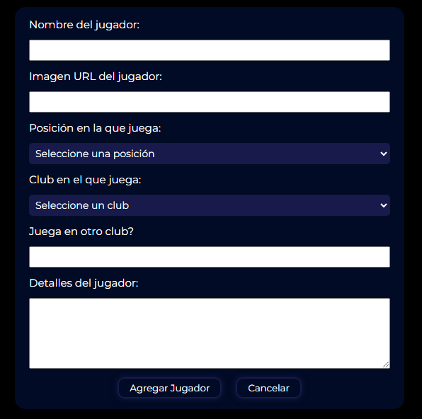
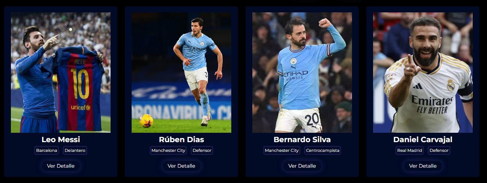
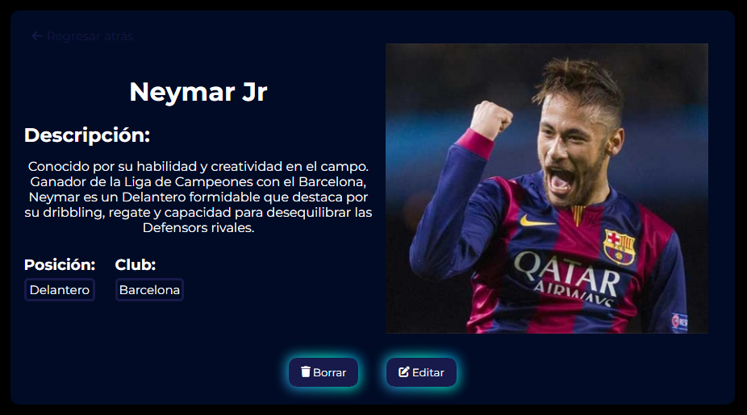

## FULBO ⚽

¡Les presento este hermoso y apasionante proyecto de **FÚTBOL**! ⚽💖

Este proyecto, creado con mucha dedicación y amor, está diseñado para mostrar la vida de los jugadores de fútbol a través de mini biografías detalladas de cada uno de ellos.

### Funcionalidades 🌟

Al abrir la aplicación, lo primero que se ve es el logo de la app y su nombre, **FULBO**. La interfaz principal incluye varias características importantes:

- **Agregar Jugadores**: Puedes agregar nuevos jugadores utilizando el botón correspondiente y completando el formulario con los datos requeridos. ¡Es muy fácil y divertido! 🎉

- **Filtros de Búsqueda**: La aplicación ofrece filtros por posición y club para que puedas buscar jugadores específicos. Una vez seleccionados los filtros, puedes usar el botón de buscar para ver los resultados filtrados. También hay un botón para limpiar filtros cuando ya no sean necesarios. ¡Encontrar a tus jugadores favoritos nunca fue tan sencillo! 🔍⚡

- **Visualización de Jugadores**: Los jugadores se visualizan en tarjetas que muestran una mini biografía, incluyendo detalles como el club y la posición. ¡Conoce a tus ídolos de una manera única! 🌟

- **Detalles de Jugadores**: Cada jugador incluye detalles específicos que se pueden visualizar en su tarjeta. ¡Descubre más sobre sus trayectorias y logros! 🏆✨

Toda la información de los jugadores se guarda y maneja a través de peticiones GET, POST, PUT y DELETE, permitiendo agregar, editar, eliminar y visualizar jugadores de manera dinámica. 💥

### Tecnologías Utilizadas 💻

Este proyecto fue desarrollado utilizando las siguientes tecnologías:

- **HTML** 🌐
- **SASS** 🎨
- **JavaScript** ✨

### Créditos 🏅

Hecho con mucho 🤍 por Male.

---

Espero que disfrutes usando este proyecto tanto como yo disfruté creándola.⚽🎉
